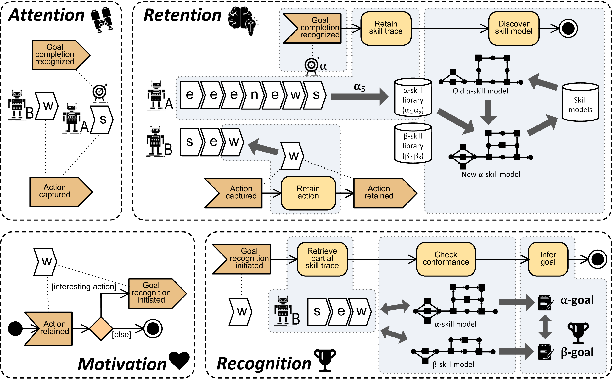

# Descriptions

### Goal Recognition Using Off-The-Shelf Process Mining Techniques

training_examples: The traces for Figure 1 and Figure 2 in XES format (Footnote 3)

tools: The code for replicate the experiments (Footnote 6)
 
datasets: The dataset for the experiments (Footnote 7)

